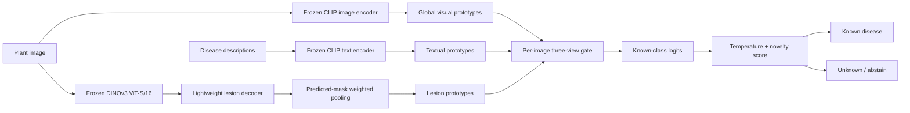

# Lesion-Aware Open-Set Plant Disease Recognition | Extension of ACM MM'24 MVPDR

A reproducible research framework for few-shot plant-disease recognition under lab-to-field
domain shift. It combines CLIP textual and global-image prototypes with lesion-localized DINOv3
features, learns a small per-image evidence gate, and can abstain on held-out disease classes.

> **Project chronology and repository status.** The academic project work was carried out from
> **September 2025 to November 2025**. This repository is a later cleaned, reproducible
> reconstruction of that work; its Git history and file timestamps describe the repository's
> actual creation, not the 2025 project period. No real experiment artifact was present when this
> reconstruction began, so prior results are not claimed or recreated. Verified real-data metrics
> are currently **not yet evaluated**.

This is deliberately the defensible four-component scope—not a FieldGuard product and not a claim
to hierarchical memory, conformal prediction, retrieval evidence, deployment, multiple foundation
models, or extensive robustness benchmarking.

## Research question

Can frozen global semantics, frozen dense local representations, and explicit lesion supervision
improve few-shot, controlled-to-field disease recognition while allowing validation-calibrated
rejection of diseases unseen during training?

The implemented contributions are:

1. an independently configurable MVPDR-style CLIP text/global prototype baseline;
2. frozen DINOv3 ViT-S/16 patch features with cache provenance;
3. a lightweight PlantSeg-supervised lesion decoder trained with BCE + Dice loss;
4. interpretable three-view gating and energy/prototype-distance open-set rejection.

These are implementation claims, not performance claims. See [Research claims](docs/claims.md).

## Architecture



CLIP and DINOv3 are frozen by default. Only the pointwise lesion decoder, gate, calibration scalar,
and optionally initialized prototype parameters are small enough to train on one normal research
GPU. Ground-truth masks supervise/evaluate the decoder; disease inference pools under the
**predicted** mask and never consumes test masks.

## Method boundaries

The baseline follows MVPDR's central idea—CLIP visual and descriptive-text multi-prototypes—but is
called **MVPDR-style**, not an exact reproduction. The authors' implementation learns initialized
visual/text prototype weights and combines text mean/max with a visual affinity kernel. This code
uses deterministic spherical k-means prototypes and explicit score fusion. It also corrects an
evaluation concern: all early stopping, temperature fitting, and rejection thresholds use
validation data only; the test set is evaluated once. Full deviations are in
[Methodology](docs/methodology.md).

## Repository map

```text
configs/                 dataset mapping and A-E experiment configurations
docs/                    architecture, methods, data, experiments, provenance
scripts/                 multi-seed orchestration helpers
src/plant_ood/           installable research package and CLI
  data/                  manifests, mappings, leakage-safe few-shot splits
  models/                frozen backbones, prototypes, decoder, gate, recognizer
  training/              lightweight training and versioned checkpoints
  evaluation/            recognition, segmentation, and OOD metrics
tests/                   synthetic unit and end-to-end tests (no model downloads)
results/                 policy for promoting verified lightweight results
```

## Installation

Python 3.10–3.13 is supported. The tested CPU development setup is:

```bash
uv venv --python 3.12
source .venv/bin/activate
uv pip install -e '.[dev]'
```

Real feature extraction additionally needs Transformers:

```bash
uv pip install -e '.[backbones,dev]'
```

For GPU training, install the PyTorch build matching the local CUDA driver first, then install this
package. DINOv3 model terms may need to be accepted on Hugging Face; place a token in `HF_TOKEN`,
never in source control. The exact defaults are `openai/clip-vit-base-patch32` and
`facebook/dinov3-vits16-pretrain-lvd1689m`; there is no silent fallback.

## Data setup

Datasets are not redistributed. Arrange legally obtained images as:

```text
data/raw/<dataset>/
  train/<class>/*.jpg
  validation/<class>/*.jpg
  test/<class>/*.jpg
```

Then create and validate the manifest:

```bash
plant-ood prepare-data --root data/raw/combined --domain mixed \
  --masks-root data/raw/plantseg_masks --output data/manifests/combined.jsonl
plant-ood validate-data --manifest data/manifests/combined.jsonl
plant-ood map-manifest --manifest data/manifests/combined.jsonl \
  --mapping configs/datasets/example_class_mapping.json \
  --output data/manifests/combined_canonical.jsonl
```

Do not assume identically worded labels are taxonomically compatible. Review an explicit JSON
mapping like `configs/datasets/example_class_mapping.json`; `null` means intentionally excluded.
Dataset sources, licenses, and a recommended protocol are detailed in [Datasets](docs/datasets.md).

## Reproducible few-shot and open-set splits

The supported shots are 1, 5, 10, and 20. A split manifest records source-manifest digest, seed,
known/unknown classes, and the exact prototype/validation/test IDs:

```bash
plant-ood make-splits --manifest data/manifests/combined.jsonl --shots 5 --seed 13 \
  --unknown apple_rust grape_black_rot --output data/splits/shot-5-seed-13.json
python scripts/run_five_seeds.py --config configs/experiments/e_open_set.yaml \
  --output-dir data/splits/e_open_set
```

Unknown classes must occur in validation (to fit the threshold) and test (to measure it), but never
in training prototypes. Split digests fail closed if the source manifest changes.

## Feature extraction and training

```bash
plant-ood extract-features --config configs/experiments/e_open_set.yaml \
  --prompts data/metadata/disease_prompts.json --output features/combined.pt

plant-ood train-lesion --features features/combined.pt \
  --split data/splits/shot-5-seed-13.json \
  --output checkpoints/lesion_decoder.pt --epochs 30

plant-ood run-experiment --config configs/experiments/e_open_set.yaml \
  --features features/combined.pt --split data/splits/shot-5-seed-13.json \
  --lesion-checkpoint checkpoints/lesion_decoder.pt
```

Run variants independently with `configs/experiments/a_...` through `e_...`:

- A: CLIP text + global MVPDR-style baseline;
- B: A + globally pooled DINOv3 local tokens;
- C: B + predicted-lesion pooling;
- D: C + learned three-view gate;
- E: D + calibrated open-set rejection.

Heavy feature bundles, checkpoints, data, and run directories are Git-ignored. Run metadata records
the config, split, backbone identifiers, environment, and actual Git SHA.

## Evaluation and outputs

`run-experiment` reports accuracy and macro-F1 on known test classes. Variant E additionally reports
AUROC and FPR95 for held-out unknown classes. `train-lesion` reports validation loss; Dice and mIoU
are available in the metrics module. Efficiency reporting includes total/trainable parameters and
trainable percentage. Outputs are written under `runs/<experiment>/seed-<seed>/` as JSON.

No table in this repository contains invented values. [results/README.md](results/README.md) defines
the promotion rule for future verified results.

## Verification

The lightweight suite never downloads datasets or foundation models:

```bash
ruff check .
ruff format --check .
mypy src
pytest
plant-ood smoke-test
plant-ood --help
```

Smoke-test metrics describe random synthetic tensors only and are not research results. CI runs the
same static checks, tests, config validation, and synthetic integration on CPU.

## Reproducibility and integrity

- Five default seeds: 13, 37, 71, 101, 137.
- Persistent sample-level and class-held-out manifests; SHA-256 source digest.
- Duplicate-content checks across splits.
- Prototype construction accepts training IDs only.
- Threshold fitting rejects any split name other than `validation`.
- Feature keys cover image digest, dataset, split, backbone/checkpoint, preprocessing, and view.
- Checkpoints and run metadata use explicit schema versions.
- No test mask enters the recognition system.

See [Reproducibility](docs/reproducibility.md) for the exact artifact contract.

## Limitations

- Real PlantVillage/PlantWild/PlantSeg experiments have not been run in this reconstruction.
- Cross-dataset class compatibility requires expert review; the example map is not a completed map.
- The simple novelty scores are baselines, not calibrated guarantees.
- Missing/incorrect lesion annotations and severe domain shift can degrade lesion pooling.
- DINOv3 access, full datasets, and GPU time are external requirements.
- This is research software and must not be used as agronomic diagnosis or treatment advice.

## References and license

The baseline is derived methodologically from Wei et al., “Benchmarking In-the-Wild Multimodal
Plant Disease Recognition and A Versatile Baseline,” ACM MM 2024,
[DOI 10.1145/3664647.3680599](https://doi.org/10.1145/3664647.3680599). Core sources include
[CLIP](https://proceedings.mlr.press/v139/radford21a.html),
[DINOv3](https://arxiv.org/abs/2508.10104), and
[PlantSeg](https://doi.org/10.1038/s41597-025-06513-4). Dataset references and access links are in
[Datasets](docs/datasets.md); machine-readable citations are in [CITATION.cff](CITATION.cff) and
[REFERENCES.bib](REFERENCES.bib).

Project-authored code is MIT licensed. Dataset, pretrained-weight, and third-party-code licenses
remain separate and must be reviewed before use or redistribution.
